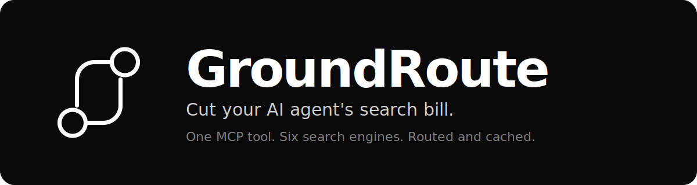

<p align="center">
  <a href="https://groundroute.ai">
    
  </a>
</p>

<p align="center">
  <a href="https://glama.ai/mcp/servers/PROJECT-B-26/groundroute-mcp"></a>
  <a href="LICENSE"></a>
  <a href="https://www.python.org/"></a>
  <a href="https://modelcontextprotocol.io"></a>
  <a href="https://smithery.ai/servers/groundroute-ai/web-search"></a>
</p>

> Give your AI agent **web search across 6 engines** through **one** MCP `search` tool. Hosted. Routed. Cached.

## Why GroundRoute

- **One tool, six engines.** Serper, Brave, Exa, Tavily, Firecrawl, Perplexity, behind a single `search` call. Stop wiring up six APIs, six SDKs, six billing portals.
- **Never more than going direct.** Gain-share pricing: you keep ~half of every cache saving, GroundRoute keeps ~half. On a miss, you just pay the engine. BYOK supported.
- **Routing, caching, failover, on by default.** Each query goes to the cheapest engine that clears a quality bar. Repeats serve from cache. If an engine degrades, we fall back automatically. No agent code changes.

## See it work (5 seconds)

A call to the `search` tool:
```json
{
  "name": "search",
  "arguments": { "query": "what is RAGflow", "max_results": 3 }
}
```

The response (trimmed):
```json
{
  "results": [
    {
      "url": "https://ragflow.io/docs/",
      "title": "Quickstart - RAGFlow",
      "snippet": "RAGFlow is an open-source RAG engine based on deep document understanding...",
      "source_engine": "serper"
    },
    {
      "url": "https://github.com/infiniflow/ragflow",
      "title": "RAGFlow is a leading open-source Retrieval-Augmented Generation engine",
      "snippet": "RAGFlow is a leading open-source Retrieval-Augmented Generation (RAG) engine...",
      "source_engine": "serper"
    }
  ],
  "meta": {
    "request_id": "req_abc123",
    "cache_tier": "miss",
    "degraded": false,
    "cost_usd": 0.0021
  }
}
```

`source_engine` tells you which engine answered. `meta` exposes the cache tier and billed cost per call.

## Benchmarked, not just shipped

We ran **170 real agent queries across all 6 engines**, judged by an LLM, to map cost vs. quality per query class. Full methodology and per-engine results: [State of AI Search](https://groundroute.ai/state-of-ai-search).

---

## Install

The hosted endpoint is `https://api.groundroute.ai/mcp` (streamable-HTTP). Get an API key at [groundroute.ai/keys](https://groundroute.ai/keys).

**Claude Desktop / Claude Code**, add to your MCP config:
```json
{
  "mcpServers": {
    "groundroute": {
      "type": "http",
      "url": "https://api.groundroute.ai/mcp",
      "headers": { "Authorization": "Bearer gr_YOUR_KEY" }
    }
  }
}
```

**Cursor**, `~/.cursor/mcp.json`:
```json
{ "mcpServers": { "groundroute": { "url": "https://api.groundroute.ai/mcp",
  "headers": { "Authorization": "Bearer gr_YOUR_KEY" } } } }
```

**VS Code** (native MCP / Continue), `.vscode/mcp.json`:
```json
{ "servers": { "groundroute": { "type": "http", "url": "https://api.groundroute.ai/mcp",
  "headers": { "Authorization": "Bearer gr_YOUR_KEY" } } } }
```

**Local / stdio-only clients**, bridge stdio to HTTP with `mcp-remote`:
```json
{ "mcpServers": { "groundroute": {
  "command": "npx",
  "args": ["-y", "mcp-remote", "https://api.groundroute.ai/mcp", "--header", "Authorization:Bearer gr_YOUR_KEY"]
} } }
```

## Run this repo's stdio server (optional)

This repo also ships a small native **stdio** MCP server (`server.py`) that forwards to the hosted API, useful for stdio-only clients or containerized runs.

```bash
pip install -r requirements.txt
GROUNDROUTE_API_KEY=gr_YOUR_KEY python server.py
```

Or with Docker:

```bash
docker build -t groundroute-mcp .
docker run -i -e GROUNDROUTE_API_KEY=gr_YOUR_KEY groundroute-mcp
```

Introspection (tool discovery) works with no key; running a search requires `GROUNDROUTE_API_KEY` (get one at https://groundroute.ai/keys).

## The `search` tool
| Param | Type | Notes |
|---|---|---|
| `query` | string | required |
| `mode` | enum | `auto` (default), `web`, `news`, `academic`, `answer`, `page` |
| `max_results` | integer | default 10, max 50 |
| `freshness` | enum | `fresh`, `semi`, `static`; omit to auto-detect |
| `domains` | string[] | include-only domain filter, e.g. `["arxiv.org"]` |
| `lang` | string | ISO 639-1 language code, e.g. `en` |
| `country` | string | ISO 3166-1 alpha-2 country code, e.g. `us` |

Returns a **structured result**: ranked `results` (url / title / snippet / content / source_engine / published_at), an optional synthesized `answer` with `citations` (answer mode), and `meta` (request_id / cache_tier / degraded / cost_usd). Routed, cached, and reliable.

## How it works
One endpoint in front of many search engines, with price-led routing, caching, failover, and usage governance. See the [docs](https://groundroute.ai/docs/mcp-server) and the [State of AI Search benchmark](https://groundroute.ai/state-of-ai-search) (170 real agent queries across all 6 engines).

## Links
- Homepage: https://groundroute.ai
- Get a key: https://groundroute.ai/keys
- Playground (try without installing): https://groundroute.ai/playground
- Docs: https://groundroute.ai/docs/mcp-server

`registry-manifest.json` in this repo is the listing manifest for MCP registries.
